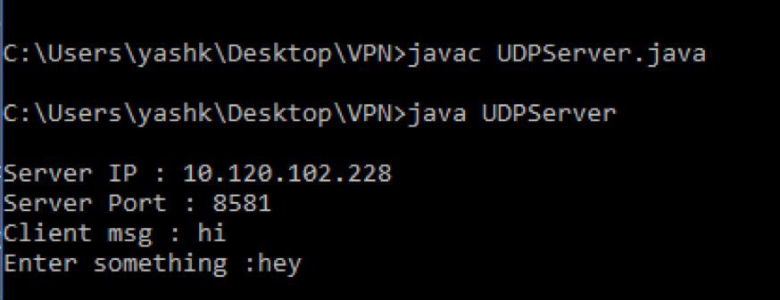
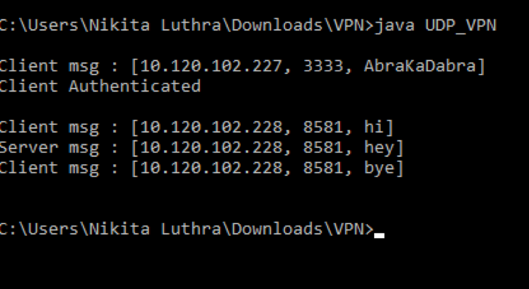
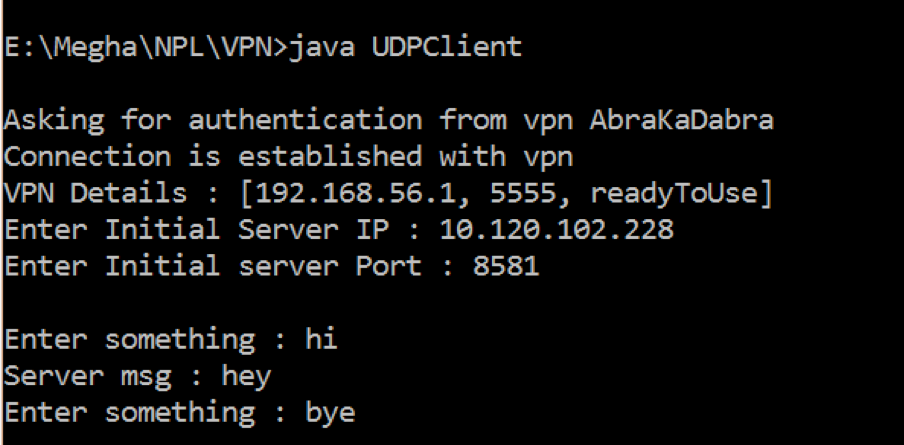

# Network-Address-Translator
Java program to demonstrate the network concept of NAT

## General Info
Network Address Translation (NAT) is a process in which one or more local IP address is translated into one or more Global IP address and vice versa in order to provide Internet access to the local hosts.

## Getting Started
In order to run this code, compile all the programs on 3 different devices and then:
1. Run the server program
2. Run the NAT program
3. Run the client program

## Workflow

•	Initially, the client will send an authentication request to the NAT. This event is not usually performed in the real world, but a similar mechanism is used. In a company, a device is assigned to perform NATing and that device is already authenticated by the underlying mechanisms.

•	The device performing NATing (in the code it's called VPN) on receiving an authentication request from the client, will securely authenticate via unique authentication key. Herein, we have just used a hardcoded string - which is not secure.

•	When the client is successfully authenticated, the device will store the corresponding IP and Port address of the client in the database. It will also store the NATing assigned IP and port address.

•	The database is implemented using the JDBC API where the database is stored in the Localhost itself.

•	On the client side, once a connection is established with the device, it asks for the server IP address and Port address.

•	The user will then enter the message to be sent to the server. 

•	A datagram packet consisting the Server’s IP, Port address and data is encapsulated and sent to the device.

•	The device will then decapsulate the packet to extract the Server’s IP and port address as well as the data to be sent.

•	A new datagram packet is made consisting of the data from the client and is sent to the server with the device’s assigned addresses - hence performing NAT.

•	The server on receiving the packet will display the message and then ask for a response. This response is then sent to the device i.e. the address from where the packet came.

•	The device will then map the received packet to the corresponding client.

•	On a “bye” message sent either by client or server, the entire established connection will be terminated.

## Output
1. Server:

2. NAT Device - VPN:

3. Client:

